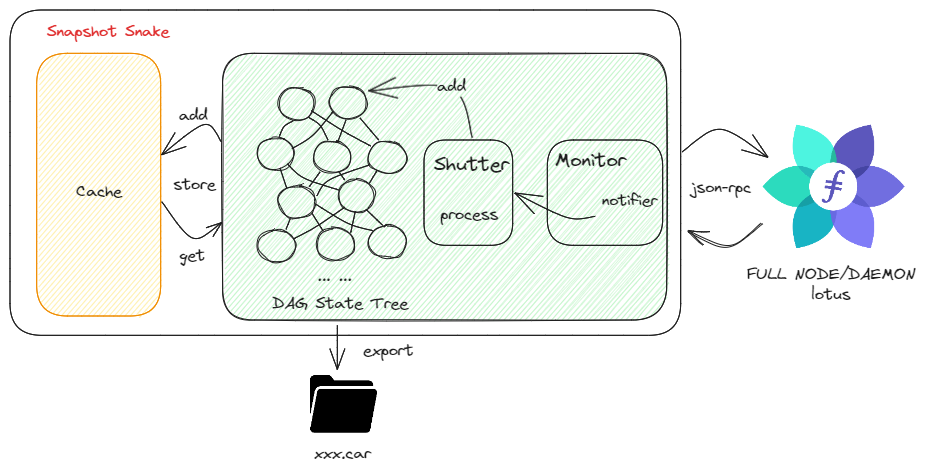

<p align="center">
  <a href="#" title="Snapshot snake">
    
  </a>
</p>

<h1 align="center">Project Snapshot Snake</h1>

Snapshot Snake is a tool that connects to Lotus nodes and exports snapshots.

## Why Snapshot Snake?

1.Export snapshots faster

2.More convenient and simple to use snapshot

3.Analysis and verification snapshot

## Getting started

**Go**

To build Snapshot Shake, you need a working installation of [Go 1.20.8 or higher](https://golang.org/dl/):

```
wget -c https://golang.org/dl/go1.20.8.linux-amd64.tar.gz -O - | sudo tar -xz -C /usr/local

## If you are in China, you should run
export GOPROXY=https://goproxy.cn
```

**TIP:** You'll need to add `/usr/local/go/bin` to your path. For most Linux distributions you can run something like:

```
echo "export PATH=$PATH:/usr/local/go/bin" >> ~/.bashrc && source ~/.bashrc
```

See the [official Golang installation instructions](https://golang.org/doc/install) if you get stuck.

**Build and install Snapshot Snake**

Once all the dependencies are installed, you can build and install the Snapshot Snake.

1. Clone the repository:

```
git clone https://github.com/filecoin-project/lotus.git
cd lotus/
```

2. Build the executable

```
go build cmd/ss
```

3. Initialize configuration information

```
ss cfg
```

4. Edit configuration

```
vim ~/.snapshot/config.toml
```

Modify according to your own configuration.

5. Start daemon

```
ss daemon run
```

It will take some time to fill the dag and cache.

6. Export snapshot snapshot

```
ss export snapshot xxx.car
```

## Architecture

